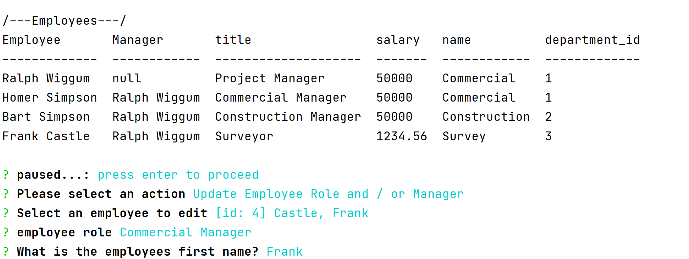

[](https://img.shields.io/badge/License-&#58&#41-yellow)
# Node Employee Tracker
## Table of Contents
> - [Table of Contents](#Table-of-Contents)
> - [Description](#Description)
> - [Installation](#Installation)
> - [Usage](#Usage)
> - [License](#License)
> - [Contributing](#Contributing)
> - [Tests](#Tests)
> - [Questions](#Questions)

## Description
Manage employees and departments using node connected to an instance of MySQL.

* [view screencast on youtube](https://youtu.be/h9DlYttWTDU)
* [View it on GitHub](https://github.com/JayArghArgh/employee-tracker)

The following goals were completed;

* Add departments, roles, employees
* View departments, roles, employees
* Update employee roles

Bonus points if you're able to:

* Update employee managers

The following were not yet implemented:
* View employees by manager
* Delete departments, roles, and employees
* View the total utilized budget of a department -- ie the combined salaries of all employees in that department



## Installation
```git clone https://github.com/JayArghArgh/employee-tracker.git``` Will clone the repo and create the following directory structure.
```md
__Assets__/
  employee-tracker.gif
  employee-tracker_SCHEMA.sql
  screenshot.png
README.md
package.json
server.js			// runs the application
```

* `node i` will install mysql, inquirer, and console.table
* open server.js and insert your mysql password.
* Navigate to Assets
* Run the following command(s) to setup the database and seed data
* `mysql -u [username] -p`
* `[enter your password]`
* `source employee-tracker_SCHEMA.sql`
* `quit`

## Usage
`node server.js` will present the user with a console based menu for adding roles, departments and employees. Employees can be edited.
## License
This application is covered under None.
## Contributing
Report all bugs
## Tests
No tests prepared.
## Questions
Please refer any questions to [](https://github.com/jayarghargh) via jayarghargh@gmail.com.

[](https://github.com/jayarghargh/github-readme-stats)


> [](https://github.com/JayArghArgh) This README.md created with [](https://github.com/JayArghArgh/pro-readme-generator).

